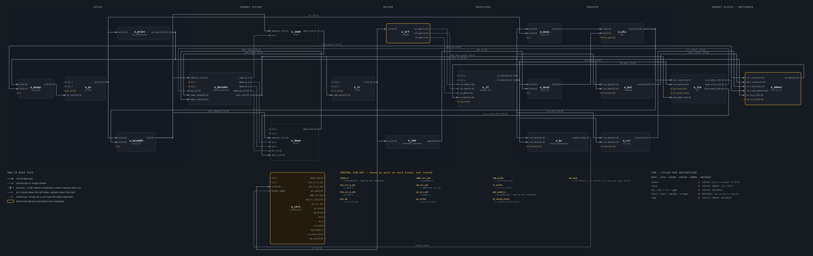

# RVBL-2 — a multicycle RISC-V processor, RTL to signed-off GDSII

**Equipe 13 · ChampionCHIP eXperience, Phase 2**

A 32-bit RISC-V core implementing **RV32I + Zmmul + Xicrc — 47 instructions** — designed,
verified, entered on the ChipInventor block canvas, and taken through OpenLane to a clean
SkyWater Sky130 layout.

The interesting part is not that it works. It is that **the chip that was taped out is
provably the design that was verified**, by mechanical check rather than assertion. See
[Equivalence](#equivalence).

| | |
|---|---|
| **ISA** | RV32I (37) + Zmmul (4) + Xicrc (3) = **47 / 47, 100 %** |
| **Microarchitecture** | 6-state multicycle FSM, 3–5 cycles per instruction, no hazards |
| **Verification** | **7,384** checks / 15 testbenches · **15,281** checks on the platform netlist |
| **Equivalence** | **410,400** cycle-by-cycle state comparisons, 0 mismatches |
| **Official firmware** | **PASS** — `x4 = 0x00000000` after 991 cycles, 9 / 9 stages |
| **Technology** | Sky130A, `sky130_fd_sc_hd`, no hard macros |
| **Die** | **0.404 mm²** (630.2 × 640.9 µm) at **52.28 %** density |
| **Cells / flip-flops** | 17,708 / 1,393 |
| **Timing** | setup **+2.25 ns** worst corner, hold +0.11 ns, 33 ns constraint |
| **Signoff** | **0** Magic DRC · **0** KLayout DRC · **0** routing violations · LVS match uniquely |

---

## The design

[](report/figures/soc-architecture.png)

*The complete datapath and control unit. Columns follow one instruction left to right:
fetch, the memory system, decode, the registers, execute, then memory access and writeback.
Every box is one of the 20 block instances on the canvas and every line is a real wire; the
control unit sits along the bottom. It is dense on purpose — this is the design itself, not
a simplification. **Click it to open full size.***

---

## Start here

| If you want to… | Read |
|---|---|
| See the whole project in 20 pages | **[`report/RVBL2_ChampionCHIP_Report.pdf`](report/)** |
| Understand the architecture | [`docs/ARCH_SPEC.md`](docs/ARCH_SPEC.md) |
| Check ISA coverage and encodings | [`docs/ISA_COVERAGE.md`](docs/ISA_COVERAGE.md) |
| See what was tested and how | [`docs/VERIFICATION_REPORT.md`](docs/VERIFICATION_REPORT.md) |
| See the physical results | [`chipinventor/openlane/RESULTS.md`](chipinventor/openlane/RESULTS.md) |
| Rebuild the canvas yourself | [`chipinventor/README.md`](chipinventor/README.md) |

## Quick start

Needs **Icarus Verilog** and **Python 3**. Yosys is optional (gate-level equivalence only).

```bash
# Reference regression — 15 testbenches, 7,384 checks
bash scripts/run_all.sh

# Platform verification — 12 gates, 15,281 checks, official firmware verdict
bash chipinventor/scripts/run_ci.sh
```

Both are self-checking and exit non-zero on any failure. Neither needs a PDK, a licence, or
a network connection. Expect about a minute each.

## How it is organised

This repository contains **one processor expressed two ways**, plus the proof that they are
the same processor.

```text
rtl/           Reference design, hierarchical — 16 modules
tb/            16 testbenches (+1 shared include) covering every module
tests/         Golden vectors and assembly test programs
scripts/       Firmware assembler, synthesis and regression drivers
docs/          Architecture spec, ISA coverage, verification and synthesis reports
macros/        Optional SkyWater SRAM macro for the DMEM variant
synth/         Committed cell reports from standalone logic synthesis

chipinventor/  The submitted implementation, flattened for the ChipInventor canvas
  blocks/        17 canvas blocks + imem_mock.v (the P&R build's 3-word ROM)
  ci_top.v       Flattened top level — the reference for the canvas wiring
  top.v          Netlist exported *by the platform* — the verified artifact
  rtl_ref/       Snapshot of rtl/ that the equivalence testbench runs against
  firmware/      Official validation firmware + a supplementary coverage program
  scripts/       Generators, the 12-gate verification driver, OpenLane runners
  openlane/      config.json, P&R sources, and the signed-off run artifacts

report/        The submitted report — LaTeX source, PDF, and its figures
```

Two directories are **generated and not committed**: `build/` (simulation artifacts) and
`synth/*.v` (synthesis netlists). Run the suites to create them.

## Equivalence

The two trees are not maintained by hand in parallel. Three mechanical checks tie them
together, and all three run automatically before anything is submitted:

1. **Lockstep equivalence.** `chipinventor/ci_top.v` runs side by side with `rtl_ref/top.v`
   in one simulation. PC, IR, all 32 registers, FSM state and the complete memory interface
   are compared **every cycle**, across both ROM programs — **410,400 comparisons, 0
   mismatches**. (`rtl_ref/` is code-identical to `rtl/`; it differs only in comments.)
2. **Graph isomorphism.** The netlist the platform exports is compared against `ci_top.v`
   as a *graph* — same instances, same partition of pins into nets — independent of the
   auto-generated names the platform assigns. A swapped or missing wire fails here rather
   than surfacing later as a puzzling simulation result.
3. **Full re-run on the export.** All 15,281 checks and the official firmware run again
   against the netlist the canvas itself produced, not against our copy of it.

So a passing export inherits the reference design's proof, and the GDSII is traceable back
to `rtl/`.

## Physical implementation

The submitted layout was produced by **ChipInventor's own OpenLane** from
[`chipinventor/openlane/config.json`](chipinventor/openlane/config.json). The same
configuration was also run locally on the identical pinned toolchain — OpenLane
`3876562d27af…` with sky130A `bdc9412b3e46…` — which is where it was tuned.

Per the organiser's instruction the synthesis netlist uses a 3-instruction mock ROM and
`DMEM_WORDS = 8`. Both reductions are visible in the run's own logs and are documented in
[`chipinventor/openlane/RESULTS.md`](chipinventor/openlane/RESULTS.md), which also verifies
that all 17 blocks of the platform's generated `hdl.v` are identical to the submitted RTL.

Three results from that work are worth reading:

- **Heuristic antenna-diode insertion cost 19.5 % of die area for nothing.** It inserted
  9,838 diodes pre-emptively and left *exactly the same* residual violating nets as targeted
  repair with 325. Disabling it shrank the die and returned ≈1.9 ns of setup slack.
- **Instance order is an area knob.** Moving one `imem` instantiation from 5th to last in
  the top module — with no logic change at all — moves cell area from 171,332 to
  191,649 µm², reproducing the platform's figure to the byte. Yosys's optimisation passes
  are order-sensitive, so a cell-count difference between two runs is *not* by itself
  evidence that the RTL changed.
- **Run-to-run slack varies by 1.6 ns** on identical inputs. Treat a single run's slack as a
  sample, not a property.

## Competition submission

The Phase 2 submission is four files, not this repository:

| Guide §9 requires | File |
|---|---|
| Report (≤ 20 pages, ≤ 10 MB) | `report/RVBL2_ChampionCHIP_Report.pdf` |
| GDSII from OpenLane | `…/results/final/gds/top.gds` |
| GL netlist, powered | `…/results/final/verilog/gl/top.v` |
| GL netlist, non-powered | `…/results/final/verilog/gl/top.nl.v` |

All four are committed: the report in `report/`, the rest under
`chipinventor/openlane/runs/platform_20260904/results/final/`. Everything else in this
repository is the evidence behind them.

## Honest limitations

Stated here for the same reason they are stated in the report:

- **86 residual antenna pins on 60 nets**, worst ratio 8.69× the limit, mostly on met3.
  Enabling heuristic diode insertion does not reduce them and costs 19.5 % of the die, so
  they are recorded rather than papered over. They do not affect DRC, LVS or routing.
- **No timing-annotated gate-level simulation after layout.** The design was compared
  against the *post-synthesis* netlist for 900 cycles with identical results, and signoff
  STA reports positive margin at every corner — but the 88 MB SDF was not kept and no
  simulation was run with it. This is the one gap in the flow.
- **The reported 30.303 MHz only echoes the 33 ns constraint**, because OpenLane clamps
  positive slack before computing it. With +2.25 ns of margin the design closes near
  32.5 MHz *on this run*. Treat 33 ns as the guarantee, not a characterised f_max.

## Licence and attribution

Built for the ChampionCHIP eXperience 2026 by Equipe 13.
`Championchip-phase-2-guide.md` is the competition brief and remains the source of truth for
all requirements.
