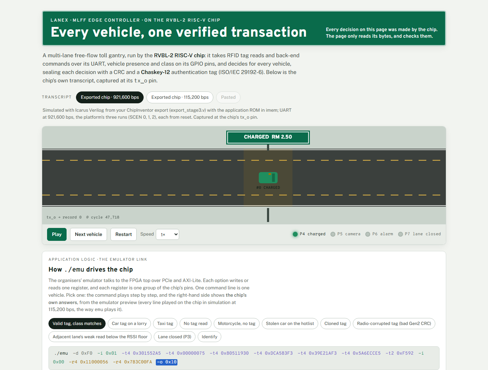
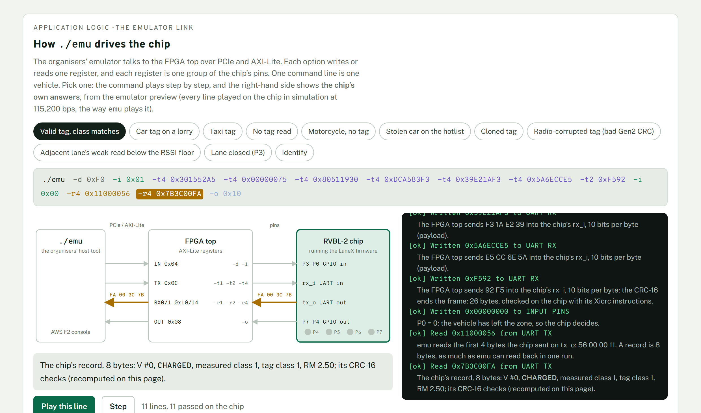
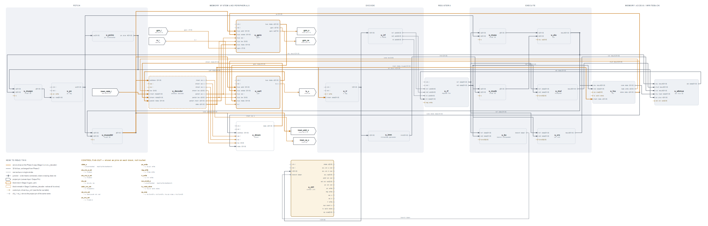

# LaneX: the free-flow transaction engine, on RVBL-2 silicon

**Equipe 13 · ChampionCHIP eXperience 2026, Stage 3**

**LaneX** is a Multi-Lane Free Flow (MLFF) edge controller on our RVBL-2 RISC-V core. Malaysia
is moving its tolls to MLFF: no barriers, no booths, vehicles at highway speed. LaneX joins the
RFID reader, the vehicle classifier and the toll back end (the operator's central system), and
turns every passing vehicle into one verified transaction: charge, photograph, or alarm, with
a record sealed by a CRC-16 and, with a key loaded, a Chaskey-12 authentication tag.

RVBL-2 is our 32-bit RISC-V processor (RV32I + Zmmul + Xicrc, 47 instructions), built on the
ChipInventor platform and taken to a signed-off Sky130 layout in Stage 2. In Stage 3 we add a
**GPIO** and a **UART**, prove them with the organisers' test firmware, and build LaneX on them.

The interesting part is not that it works. It is that **every decision is the chip's own, and
every one is checked against an independent model**: the firmware must agree with a Python
golden model on every byte it sends and every pin it drives, on the design exported by the
platform itself. See [How the chip is proven](#how-the-chip-is-proven).

| | |
|---|---|
| **Official firmware testbench** | **PASS**: 34/34 checks, on the canvas design, the platform's exported netlist, and the ChipInventor simulator |
| **Application testbench** | **PASS**: directed 78/78 · showcase 30/30 (also at 921,600 bps) · fuzz 262/262 · random 396/396 · coverage 34/34 bins |
| **Emulator preview** | **PASS**: 11/11 `./emu` command lines of the application, 4/4 of the official firmware, played on the chip |
| **On ChipInventor** | application SCEN 0, 1, 2: 13/13, 8/8, 6/6 · the full chip suite: 15,517 checks |
| **GPIO and UART, alone** | `tb_gpio` 42 · `tb_uart` 243 · `tb_periph_soc` 25 · the chip suite's SUITE 4 (Stage 3 peripherals): 219 |
| **Firmware** | C → assembly ([`main.s`](application/firmware/out/lane/asm/main.s)) → the organisers' Firmware Builder: 2,722 instructions in a 2,774-word image, 2,892 B of static data; rebuilt byte-identical with Ubuntu's GCC 13.2 |
| **Timing** | boot 1,758 cycles · a received byte waits at most 199 cycles (one byte lasts 2,630) · decision at most 0.62 ms after the vehicle leaves |
| **Equivalence** | the ChipInventor design runs in lockstep with the reference RTL: 1,238,859 comparisons, 0 mismatches |

---

## Competition submission: Guide §9

Everything Submission Guide §9 asks for, linked directly. The report PDF is submitted on the
ChampionCHIP platform and the video is on YouTube; **everything else is in this repository**.

| Guide §9 requires | Where it is |
|---|---|
| Technical report (PDF, max. 7 pages) | submitted on the ChampionCHIP platform (7 pages, 1.6 MB); its figures are in [`report-stage3/figures/`](report-stage3/figures/) |
| GitHub link | this repository, branch **`stage3`** |
| Video demo (YouTube) | *link to be added* (also on the report's first page) |
| All developed source code (C, Verilog) | Verilog: **[`rtl/`](rtl/)** (with `gpio.v`, `uart.v`), **[`chipinventor/blocks/`](chipinventor/blocks/)** · C: **[`application/firmware/`](application/firmware/)** · testbenches: **[`official-firmware-testbench/`](official-firmware-testbench/)**, **[`application/testbench/`](application/testbench/)**, **[`tb/`](tb/)** |
| Live demonstration | **[https://niccc8.github.io/rvbl2-riscv-cpu-core/demo/](https://niccc8.github.io/rvbl2-riscv-cpu-core/demo/)**: the chip's own records, replayed and checked in your browser |
| Complete firmware, binary and assembly | **The application in assembly: [`application/firmware/out/lane/asm/main.s`](application/firmware/out/lane/asm/main.s)**, with [`hal.s`](application/firmware/out/lane/asm/hal.s), [`divmod.s`](application/firmware/out/lane/asm/divmod.s) and [`crt0.s`](application/firmware/out/lane/asm/crt0.s): the complete program · **the binary: [`firmware.bin`](application/firmware/out/lane/firmware.bin)**, with `firmware.txt` (the IMEM lines) and `firmware.dmp` (the disassembly) · [how to read `main.s`](application/firmware/README.md#reading-mains) · the official test firmware: [`official-firmware-testbench/firmware/`](official-firmware-testbench/firmware/) |

---

## LaneX at work

**Try it: [https://niccc8.github.io/rvbl2-riscv-cpu-core/demo/](https://niccc8.github.io/rvbl2-riscv-cpu-core/demo/)**

[](report-stage3/figures/demo_page.png)

*The demonstration page. It replays the chip's own simulation log: each vehicle passes the
gantry, the lamps P4–P7 light as the chip drove them, and every 8-byte record is listed. The
page recomputes every CRC-16 and Chaskey-12 tag with its own code; click any byte to flip a
bit and watch both checks fail. It decides nothing itself. It is one self-contained file,
[`docs/demo/index.html`](docs/demo/index.html), built by
`python application/replay/gen_lane_replay.py --standalone --out docs/demo/index.html` and
served by GitHub Pages; open it locally just as well.*

[](report-stage3/figures/demo_emu_panel.png)

*The emulator link, on the same page. One `./emu` command line is one vehicle. Each option
writes or reads one register of the FPGA top (the addresses of the organisers' `emu.c`), and
each register is one group of the chip's pins. The right-hand side is the chip's own answer,
from the emulator preview.*

## The design

[](report-stage3/figures/architecture/rvbl2_soc_architecture.png)

*The SoC project `rvbl2_soc`, every block and wire; new in Stage 3 in amber: the GPIO, the
UART and the address decoder's peripheral region. The chip project `top` places the SoC as one
block with the instruction memory and the pins
([drawing](report-stage3/figures/architecture/top_architecture.png)). Why two projects: the
SoC is the same for every target (tri-state Inout Pins on the ASIC, the organisers' AXI
wrapper on the FPGA), and a new program is one pasted `imem` block. **Click to open full size.***

## The brief, step by step

The Stage 3 Submission Guide's workflow, and where each step is.

| Brief | Step | Folder | Start with |
|---|---|---|---|
| §2 | GPIO & UART integration | [`rtl/`](rtl/) (`gpio.v`, `uart.v`, `address_decoder.v`), [`chipinventor/`](chipinventor/) | [`docs/GPIO_UART_INTEGRATION.md`](docs/GPIO_UART_INTEGRATION.md) |
| §3 | Official firmware testbench | [`official-firmware-testbench/`](official-firmware-testbench/) | its [README](official-firmware-testbench/README.md) |
| §4 | Application definition | [`application/`](application/) | its [README](application/README.md), then [`PROTOCOL.md`](application/PROTOCOL.md) |
| §5 | Application firmware development | [`application/firmware/`](application/firmware/) | its [README](application/firmware/README.md) |
| §6 | Application firmware testbench | [`application/testbench/`](application/testbench/) | its [README](application/testbench/README.md) |
| — | Emulator preview | [`application/emulator-preview/`](application/emulator-preview/) | its [README](application/emulator-preview/README.md) |
| — | Demonstration | [`application/replay/`](application/replay/), served from [`docs/demo/`](docs/demo/) | [the live page](https://niccc8.github.io/rvbl2-riscv-cpu-core/demo/) |

## The organisers' material, and where we used it

All three folders of the organisers'
[Stage 3 repository](https://github.com/championchip-experience-community/CCX_Malaysia_Edition_Stage_3)
are used as they are:

| Their folder | Here | How |
|---|---|---|
| `RVBL-GPIO-UART-Test-Firmware` | [`official-firmware-testbench/firmware/`](official-firmware-testbench/firmware/) | `main.s` and `firmware.txt`, unchanged; the `firmware.txt` lines go into our `imem` as their README says ([`gen_imem.py`](official-firmware-testbench/gen_imem.py)) |
| `RVBL-Firmware-Builder` | [`tools/rvbl-firmware-builder/`](tools/rvbl-firmware-builder/) | an unchanged copy. It rebuilds their `firmware.txt` byte for byte, and builds our application: [`application/firmware/Makefile`](application/firmware/Makefile) calls it with `make -f` |
| `RVBL-Emulator` | [`application/emulator-preview/`](application/emulator-preview/) | our `./emu` command lines use its options (`-d -i -o -t1/2/4 -r1/2/4`), and the preview plays them on the chip the way `emu.c` does: reset first, bytes least-significant first, `-o` over the whole OUT register |

To check it yourself: clone their repository, then
`diff -r <clone>/RVBL-Firmware-Builder tools/rvbl-firmware-builder` (only our `ABOUT.md`
differs) and `diff <clone>/RVBL-GPIO-UART-Test-Firmware/src/main.s official-firmware-testbench/firmware/main.s`.

## Reproduce it

Needs **Icarus Verilog**, **Python 3**, and, to build firmware, **make** and a **RISC-V GNU
toolchain** (the organisers' Makefile finds `riscv32-unknown-elf` or `riscv64-unknown-elf`;
we used xPack GCC 13.2.0, `riscv-none-elf`).

```sh
# The official firmware testbench: rebuilds the organisers' firmware with their Makefile,
# runs it on the chip, and plays their ./emu example (about 10 s)
bash official-firmware-testbench/run.sh

# The application firmware, built the organisers' way
make -C application/firmware              # or: make -C application/firmware TC=riscv-none-elf

# Everything: every testbench of Stage 2 and Stage 3 (RUN_LONG=1 adds the fuzz and random runs)
bash scripts/run_all.sh

# The ChipInventor design, including the checks of the platform's exported netlist
bash chipinventor/scripts/run_ci.sh
```

All are self-checking and exit non-zero on any failure. The application runs simulate every
UART bit at the chip's real 115,200 bps, so they are the slow part: `run_all.sh` takes about
10 minutes (about 55 with `RUN_LONG=1`), `run_ci.sh` about a minute.

`run_ci.sh` checks the export whichever of our ROMs its `imem` holds (the validation ROM, the
application's, or the official test firmware's; it names which), and runs each suite with the
ROM that suite needs swapped in. Nothing else in the export changes.

**On the ChipInventor platform** (project `top`):

| To run | In the `imem` block's Code | As the testbench |
|---|---|---|
| The organisers' test firmware | `official-firmware-testbench/imem_official.v` | `official-firmware-testbench/tb_official_firmware.v` |
| Its waveform (0.39 ms: one echo, one pin change) | the same | `official-firmware-testbench/tb_wave_official.v` |
| The application | `chipinventor/app/imem_app.v` | `chipinventor/build/tb_app_platform.v` (written by `run_ci.sh`), with `SCEN` = 0, 1, 2 |
| Its waveform (3.65 ms: one car, one tag read, one record) | the same | `application/testbench/tb_wave_app.v` |
| The full Stage 2 + 3 suite | `chipinventor/blocks/imem.v` | `chipinventor/build/tb_platform.v`, with `PART` = 1, 2, 3, 4 |

## How the chip is proven

Three mechanical checks tie the design we verify to the design the platform holds:

1. **Lockstep equivalence.** `chipinventor/ci_top.v`, the mirror of the canvas, runs side by
   side with the reference RTL in `rtl/`. PC, IR, all 32 registers, the FSM and the memory
   and peripheral interface are compared every cycle: **1,238,859 comparisons, 0 mismatches**.
2. **The export, wire by wire.** Before any simulation, the netlist ChipInventor exports is
   compared with our design as a graph (same instances, same nets), independent of the names
   the platform generates. A swapped wire fails here.
3. **Everything again on the export.** The chip suite (15,517 checks), the official firmware
   and the application run again on the platform's own netlist.

And one check ties the firmware to its specification: the **golden model**
([`lane_model.py`](application/testbench/lane_model.py)) writes every scenario and the exact
bytes and pins the chip must produce. The firmware is never compared with itself.

## Repository layout

```text
rtl/                          the processor, the GPIO and the UART (reference Verilog)
tb/                           a testbench for every module of rtl/, and for the SoC
chipinventor/                 the design as drawn on the ChipInventor canvas: blocks, block icons,
                              the canvas mirror (ci_top.v), the platform testbenches, export checks
official-firmware-testbench/  brief §3: the organisers' test firmware, our IMEM and testbenches, logs
application/                  brief §4-6: LaneX
  PROTOCOL.md                   frames, records, decisions, timing
  firmware/                     the C firmware; out/lane/ holds the delivered firmware
  testbench/                    the golden model and the testbenches that check the firmware
  emulator-preview/             ./emu command lines, played on the chip
  replay/                       the demonstration page: replays the chip's log and checks it
tools/rvbl-firmware-builder/  the organisers' Firmware Builder, an unchanged copy
report-stage3/figures/        the Stage 3 report's figures, and our architecture drawings (SVG, PNG)
docs/demo/                    the demonstration page, as GitHub Pages serves it
docs/, scripts/, tests/       specifications and reports; regression drivers; test programs
report/, macros/, synth/      Stage 2: report, optional SRAM macro, synthesis reports
```

`build/` is generated and not committed: the scripts above create it.

## Honest limitations

- **Not yet on hardware.** The emulator preview plays the `./emu` lines on the chip in
  simulation, with `emu.c`'s semantics. The AWS F2 run is Stage 4.
- **The platform runs the application at 921,600 bps.** The ChipInventor simulator stops a
  run after a fixed wall-clock time, so its three application runs use a faster UART. The
  runs at the chip's real 115,200 bps are local (Icarus Verilog), on the platform's export.
- **The frame timeout is off by default.** `emu` sends one byte per register access, about
  0.1 s apart, so any timeout would cut its frames. A host that streams its bytes can turn
  it on with the `P` frame.
- **The tag's class byte is our assumption.** The chip reads the registered class from the
  first EPC byte; the Touch 'n Go tag layout is not public.

## Stage 2: the processor and the chip

| | |
|---|---|
| **ISA** | RV32I (37) + Zmmul (4) + Xicrc (3) = 47 instructions |
| **Microarchitecture** | 6-state multicycle FSM, 3–5 cycles per instruction |
| **Official validation firmware** | PASS: `x4 = 0x00000000` after 991 cycles |
| **Technology** | Sky130A, `sky130_fd_sc_hd`; die 0.404 mm², setup +2.25 ns at 33 ns, 0 DRC, LVS clean |

The Stage 2 report is [`report/RVBL2_ChampionCHIP_Report.pdf`](report/RVBL2_ChampionCHIP_Report.pdf),
and the Stage 2 physical results are in
[`chipinventor/openlane/RESULTS.md`](chipinventor/openlane/RESULTS.md).

## Attribution

Built for the ChampionCHIP eXperience 2026 by Equipe 13. The files in
[`tools/rvbl-firmware-builder/`](tools/rvbl-firmware-builder/) and
[`official-firmware-testbench/firmware/`](official-firmware-testbench/firmware/) (`main.s`,
`firmware.txt`) are the organisers' own, copied unchanged from their
[Stage 3 repository](https://github.com/championchip-experience-community/CCX_Malaysia_Edition_Stage_3);
the `./emu` command format is theirs too. Everything else is our own work. The Chaskey-12
test vectors are from the public-domain (CC0) reference implementation.
